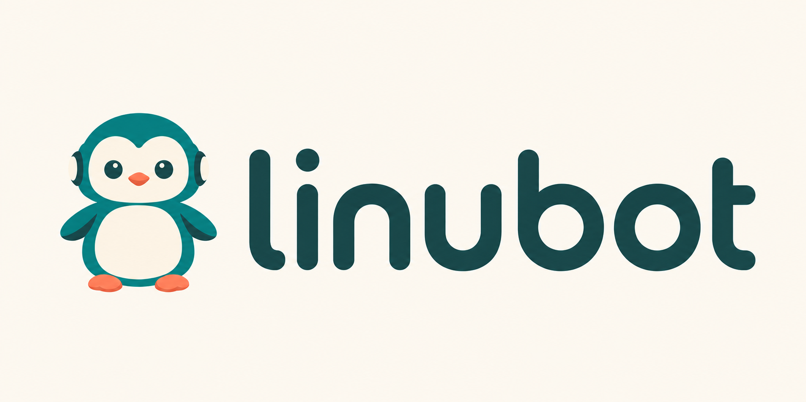
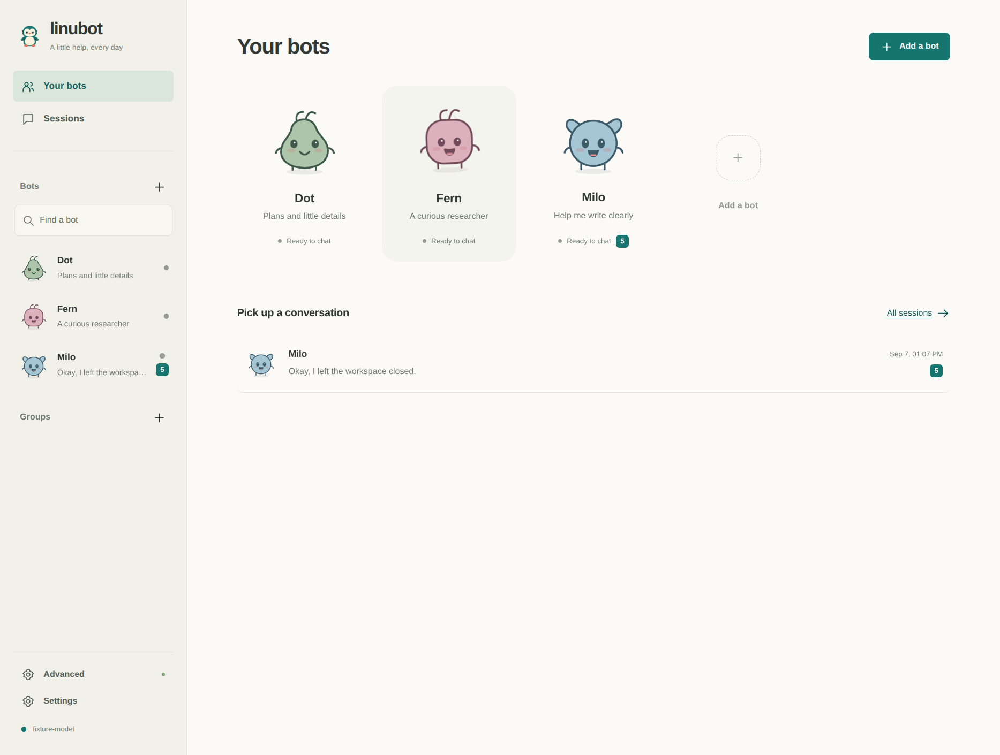

<p align="center"></p>

# Linubot

Your own team of AI helpers in a Linux desktop app. Give each bot a role, connect
your model providers, and keep conversations, memories and files on your computer.

[Documentation](docs/README.md) · [Provider setup](docs/PROVIDERS.md) ·
[Contributing](CONTRIBUTING.md) · [Security](SECURITY.md)

Bots and conversations are the main screen. Each helper has its own mascot;
groups bring helpers together. Learning, evaluations and detailed controls are
there when you need them, under Advanced.

Install the latest stable release on **Linux x86-64 with glibc 2.39 or newer**
using the [user installer](install.sh). The desktop and workspace have been
tested on Ubuntu 26.04:

```sh
curl -fsSL https://raw.githubusercontent.com/agent-sh/linubot/main/install.sh -o /tmp/linubot-install.sh
bash /tmp/linubot-install.sh --launch
```

Connect a provider in **Settings**, choose **Add a bot**, and send a message such
as “Help me plan tomorrow.” The installer verifies the release checksum and
installs for your user without sudo. See [installation](docs/INSTALLATION.md)
for wget, system packages and source builds.



Use the same bots from your phone with [private phone access and the Android app](docs/PHONE.md).
Skills and connected tools are [discovered on demand](docs/DISCOVERY.md).

## When to use it

- Use it when you want separate helpers for research, writing and everyday plans.
- Use it when different bots need different model providers or local endpoints.
- Use it when a bot needs its own browser and desktop for a computer task.
- Use it when you want to bring existing Hermes or Grok Bot teammates into a
  local application.

## How it works

A **bot** has a role, model, skills and continuing conversation. A **group** lets
several bots take turns in one conversation. **Sessions** take you back to those
conversations; detailed task activity stays expandable inside them.

Connect several providers at once and choose a provider and model for each bot.
Changing the app default leaves the other connections available. Model dropdowns
read the selected endpoint's catalog, with custom IDs available when needed.

## What your bots can do

- **Use the web:** search public pages, read HTTPS sources and browse JavaScript
  sites in an owned workspace. Search providers are configurable.
- **Use a computer:** work in a separate Linux display through
  [agent-workspace-linux](https://github.com/agent-sh/agent-workspace-linux).
  Open **Computer** inside a bot or group conversation to watch, expand the view
  or take control for a private sign-in. **Return to bot** resumes its work from
  the updated screen. See [computer controls](docs/COMPUTER.md).
- **Connect tools and skills:** discover remote MCP servers, configure custom
  tools, and preview skills from online catalogs, GitHub or local folders.
- **Remember useful details:** bots can save, correct and forget shared facts
  during a conversation. Inspect, edit or pause those writes in Advanced.
- **Continue long conversations:** compaction keeps a smaller working context
  while preserving session logs for recovery. Native provider compaction has a
  portable fallback, and bots can reopen original events.
- **Bring existing teammates:** preview Hermes profiles or locally cached Grok
  bots and groups. Imported skills start as drafts and routines start paused.

## Connections and configuration

OpenAI Chat Completions, Responses, Anthropic Messages and bearer-authenticated
Converse endpoints are supported, including custom and local servers. Prepared
providers and available browser sign-in methods are listed in the
[provider guide](docs/PROVIDERS.md). API compatibility alone does not imply
access through a provider's consumer subscription.
[Tiyuvta](https://inference.tiyuvta.ai/) is the recommended first connection.

Settings contains provider connections, web search, connected tools and long
conversation budgets. A bot's options select its connection, model and skills.
Advanced contains memory, routines, demonstrations and evaluations.

**Bot options → Delete bot** previews the effects on groups and routines before
confirmation. Past messages and shared team memory are retained. See
[bot management](docs/UX.md#deleting-a-bot).

When a newer release is available, **Upgrade to …** appears in the sidebar.
Managed user installs can download, verify and restart after confirmation;
other installs open the release page. See [updates](docs/UPDATES.md).

Desktop data defaults to `~/.local/share/linubot`, respects `XDG_DATA_HOME`, and
can be moved with `LINUBOT_DATA`. Model requests, web calls and MCP calls go to
the services you choose. See [architecture and storage](docs/ARCHITECTURE.md).

## Requirements and limits

Linubot is for Linux. Shipped x86-64 binaries require **glibc 2.39 or newer**.
The desktop and real workspace have been tested on **Ubuntu 26.04**. Meeting the
glibc minimum alone does not qualify another distribution or architecture;
those environments need their own dependency and behavior checks.

An owned desktop separates display and input. It is not, by itself, a filesystem
security boundary. Executable tools run under your Linux account. Review the
[security model](SECURITY.md) before granting access.

Workspaces and their disposable browsers belong to the current task and close
when it ends. Browser sign-ins are not promised to persist across tasks.

Grok Bot imports contain only locally cached data; cloud instructions, memory,
skills, schedules and files are unavailable. Hermes imports also have bounded
history and format limits. See [imports](docs/IMPORTS.md).

Model capabilities depend on the endpoint and account. Compaction can lose
details until the bot retrieves them from the archive. Evaluations use explicit
checks; a passing result is not a general guarantee of correctness.

## Development

Use Node.js 24 or newer, npm and the Linux GUI libraries from the
[installation guide](docs/INSTALLATION.md#run-from-source).

```sh
git clone https://github.com/agent-sh/linubot.git
cd linubot
npm ci
npm start
npm run typecheck
npm test
npm run build
xvfb-run --auto-servernum npm run test:desktop
```

The [validation guide](docs/VALIDATION.md) distinguishes automated fixtures,
real workspace checks and live provider testing. The optional browser development
server is available through `npm run dev`; the desktop is the product interface.

## Contributing and license

Read [CONTRIBUTING.md](CONTRIBUTING.md) for setup and review expectations. Report
vulnerabilities through [SECURITY.md](SECURITY.md).

Linubot is licensed under [Apache-2.0](LICENSE). Third-party components retain
their own licenses; see [NOTICE](NOTICE).
