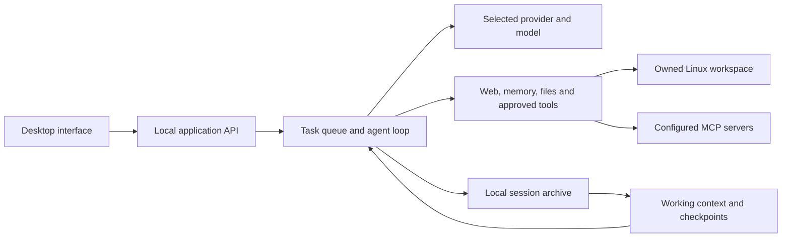

# Architecture

Linubot combines an Electron shell, a Node/TypeScript application server and a
plain JavaScript interface. The desktop runs for one local Linux user. Bots and
groups share the application process and its task scheduler.

## Processes and request flow

`desktop/main.cjs` owns the server lifecycle and native window. The packaged app
uses a random loopback port with a per-launch API credential. The renderer has
context isolation and sandboxing enabled, with Node integration disabled.
Provider credentials stay in the backend; the renderer receives status and
model information.

`src/server.ts` serves the interface and routes API requests. The optional
browser development server listens on `127.0.0.1:5598`. Its routes are internal
application interfaces, not a stable public SDK or a supported multi-user service.

## Conversations and tasks

Bots are profiles with instructions, a stable mascot seed, selected skills and
optional provider/model overrides. A group names its participating bots.
Messages enter a durable queue and become task records; group turns are routed
into the shared conversation with their original speaker attribution.

The agent loop loads the bot's context, calls its selected model, executes
available tools and records the outcome. Workspace access and MCP invocations
go through explicit runtime approvals. The user can stop a task or redirect
work. A restart marks interrupted work instead of treating it as successful.

Events share an ordered JSONL feed: messages, tool calls/results, files,
approvals, notices and observable progress. These records support the interface,
history reconstruction and exact archive recovery.

## Providers

Named connections remain available simultaneously. The app default applies to
bots that follow it; an explicit bot connection remains selected when that
default changes. Live model catalogs populate model selectors, with manual IDs
available for endpoints without discovery.

Transport format and authentication are separate. Supported formats include
OpenAI-compatible Chat Completions, Responses, Anthropic Messages and bearer
Converse. Provider-specific setup and browser connection behavior belong in the
[provider guide](PROVIDERS.md).

Connection settings contain endpoint/model configuration, not API keys. Keys
are bound to connection identity and endpoint. They are kept in process memory,
or encrypted through Electron's system-backed credential storage when available.
Externally managed sign-ins keep their provider-specific ownership rules.

Some models require private continuation metadata to accompany subsequent tool
results. The adapters preserve supported reasoning/signature fields without
rendering them as conversation text. Changing provider, account or model
invalidates incompatible continuation data.

## Context and memory

The event archive is authoritative history. The context manager constructs
completed task blocks and keeps recent tool-call/result groups complete. Older
observations may be replaced by exact archive references before compaction.
Native provider output remains opaque; portable checkpoints summarize older
work while the current request and system instructions stay separate.

Checksums, conversation identity, provider identity and memory revisions guard
checkpoint reuse. Checkpoint replacement is atomic and retains the previous
snapshot. Compaction has its own bounded maintenance allowance. Archive recovery
can continue the same task after a compaction service failure without replaying
completed effects or importing historical approvals.
See [long conversations](CONTEXT.md) and [the research](research/compaction/README.md).

Shared facts and user preferences live in bounded memory stores. During an
ordinary chat, the bot decides whether to add, replace or remove an entry using
an exact quote from the current user message. Owner edits invalidate stale
writes. Imported bot memories remain scoped to that bot. See [memory](BOT-MEMORY.md).

## Storage

All paths below are relative to the configured application data directory.

| Data | Location or form |
| --- | --- |
| Bot profiles and imported context | `profiles/` |
| Group membership | `groups.json` |
| Provider configuration | `providers.json`; legacy `provider.json` is read for migration |
| Session events | `feed-*.jsonl` |
| Task records and artifacts | Local JSON records and artifact files |
| Derived context checkpoints | `contexts/` |
| Shared memory and user context | `MEMORY.md`, `USER.md` |
| Installed skill bundles | `skills/` |
| Routine configuration and execution log | `jobs.json`, `executions.jsonl` |
| Import receipts | `imports/` |

JSON updates use temporary files and atomic renames. The event archive is
append-only during normal task execution. Compaction does not replace it.
Deleting a memory entry changes future saved context, not existing conversation
messages. See [installation](INSTALLATION.md#data-and-profiles) for backups and
profile separation.

## Tools, extensions and imports

Public page reads validate network addresses and redirects, and apply byte/time
limits. Browser automation uses the task's own workspace ID. Normal input stays
on that workspace; executable launches and external commitments have additional
approval requirements. The owned display is not itself a filesystem sandbox.

MCP discovery uses the official registry. Installation reviews the selected
transport or pinned package. Tool annotations never grant permission; invocations
are approved by the application. Remote skills are pinned, previewed as bounded
bundles and installed as drafts before approval and attachment to a bot.

Imports use a bounded preview then commit. Historical messages remain inactive,
skills arrive as drafts and compatible routines arrive paused. The source is
read without changing its data or credentials. See [import limits](IMPORTS.md).

Security-sensitive changes should preserve these runtime boundaries and follow
[SECURITY.md](../SECURITY.md). The tests corresponding to each boundary are
listed in [validation](VALIDATION.md).
